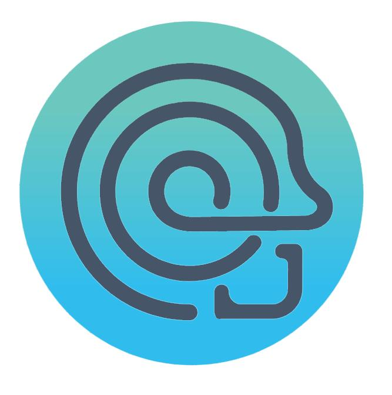
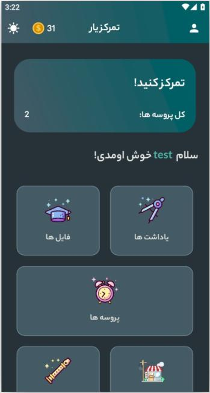
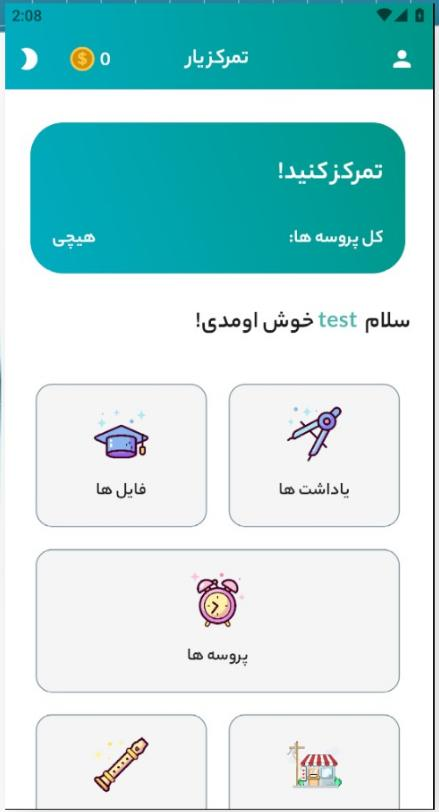
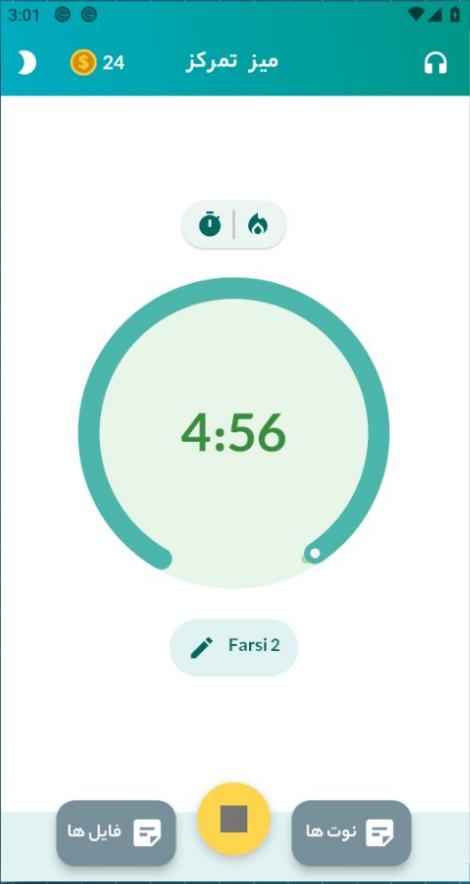

# Focusizer / Taskizer 🎯

## 📸 Screenshots

| Idea (Logo) | Menu (Dark) | Menu (Light) | Timer |
|:-----------:|:-----------:|:------------:|:-----:|
|  |  |  |  |

> **A cross-platform productivity app that helps you focus, track tasks, earn rewards, and build better habits — all while learning advanced Flutter concepts.**

---

## 📌 Overview

**Focusizer** (formerly Taskizer) is a full-featured focus and task management application built with Flutter. It combines a Pomodoro-style timer, local task storage, background music player, file manager, notes, and an in-app coin reward system — all with a clean Persian/English interface.  

This project demonstrates my ability to design and implement real-world mobile applications, manage complex state, handle background processes, and create a smooth user experience on Android (with potential for iOS/Web).

> **Why this project matters for my application:**  
> It showcases practical skills in mobile development, architectural thinking, and self-driven learning — from my early coding days to a polished, functional product.

---

## ✨ Key Features

| Feature | Description |
|---------|-------------|
| 🧠 **Focus Timer** | Customizable countdown timer with foreground service support (keeps running even when the app is closed). |
| 🎵 **Background Music** | Integrated audio player (`just_audio`) to play focus-enhancing music or ambient sounds. |
| 📝 **Notes & Files** | Create notes, attach files, and manage them locally. |
| 🪙 **Reward System** | Earn virtual coins by completing focus sessions; spend them in the built-in shop. |
| 🛒 **In-App Shop** | (Work in progress) Purchase items/upgrades using earned coins — gamifying productivity. |
| 🌓 **Theme & Fonts** | Dark/light mode toggle + custom Persian font ('Bach') for better readability. |
| 🔔 **Notifications** | Local notifications for timer start/end, using `awesome_notifications`. |
| 🔐 **Secure Storage** | User preferences and sensitive data stored with `flutter_secure_storage`. |
| 🌐 **Localization** | Fully translated to Persian (fa-IR) — can be extended to other languages. |

---

## 🧱 Technical Stack & Architecture

| Area | Technology | Why |
|------|------------|------|
| **Framework** | Flutter 3.16+ | Cross-platform, fast development, beautiful UI. |
| **State Management** | Riverpod | Modern, testable, and scalable — avoids boilerplate. |
| **Local Database** | Hive | NoSQL, lightweight, and fast for storing tasks, notes, and user data. |
| **Background Processing** | `flutter_foreground_task` + `awesome_notifications` | Ensures timer works reliably in the background. |
| **Audio** | `just_audio` | Powerful and flexible audio playback. |
| **File Handling** | `file_picker` | Native file selection and management. |
| **Secure Storage** | `flutter_secure_storage` | Encrypted storage for tokens/sensitive info. |
| **Architecture Pattern** | Feature-first / Page-based | Clean separation of concerns; pages, models, providers, and widgets are isolated. |

The project follows a **modular structure**:
